# 국회입법도우미

국회 입법예고 시스템에서 시민들의 의견 개진을 돕는 크롬 확장프로그램입니다.

## 소개

국회입법도우미는 국민의 입법 참여를 더 쉽고 편리하게 만들기 위해 개발되었습니다. 이 확장프로그램을 통해 시민들은:

- 오늘 마감되는 입법예고 법안들을 한눈에 확인할 수 있습니다
- 각 법안의 주요 내용과 제안자 정보를 쉽게 파악할 수 있습니다
- 간편하게 의견을 등록할 수 있습니다

## 주요 기능

- 오늘 마감하는 입법예고 법안 자동 필터링
- 법안별 제안자 및 정당 정보 제공
- 의견등록 페이지 바로가기
- 의견등록 여부 저장

## 설치 방법

1. Chrome 웹 브라우저를 열고 [설치 페이지](https://chromewebstore.google.com/detail/%EA%B5%AD%ED%9A%8C%EC%9E%85%EB%B2%95%EC%98%88%EA%B3%A0-%EB%8F%84%EC%9A%B0%EB%AF%B8/kjmcflcbfmffcbklmogifcpilcngnima)로 이동합니다.
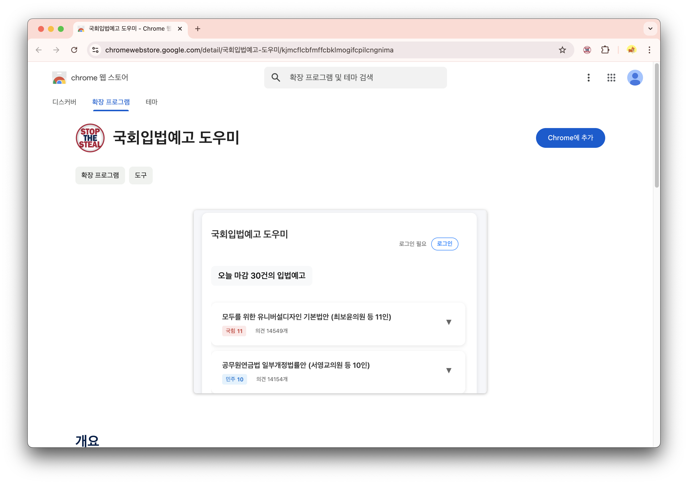

2. 오른쪽 상단 Chrome에 추가 버튼을 클릭합니다.
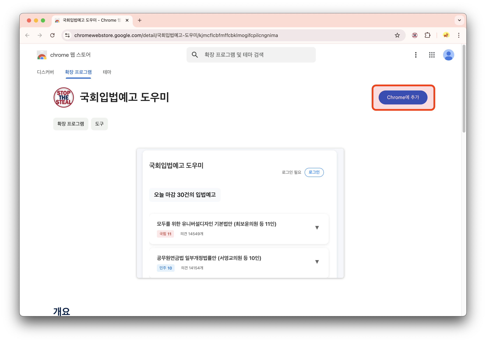

3. 확장 프로그램에 추가 버튼을 클릭합니다.
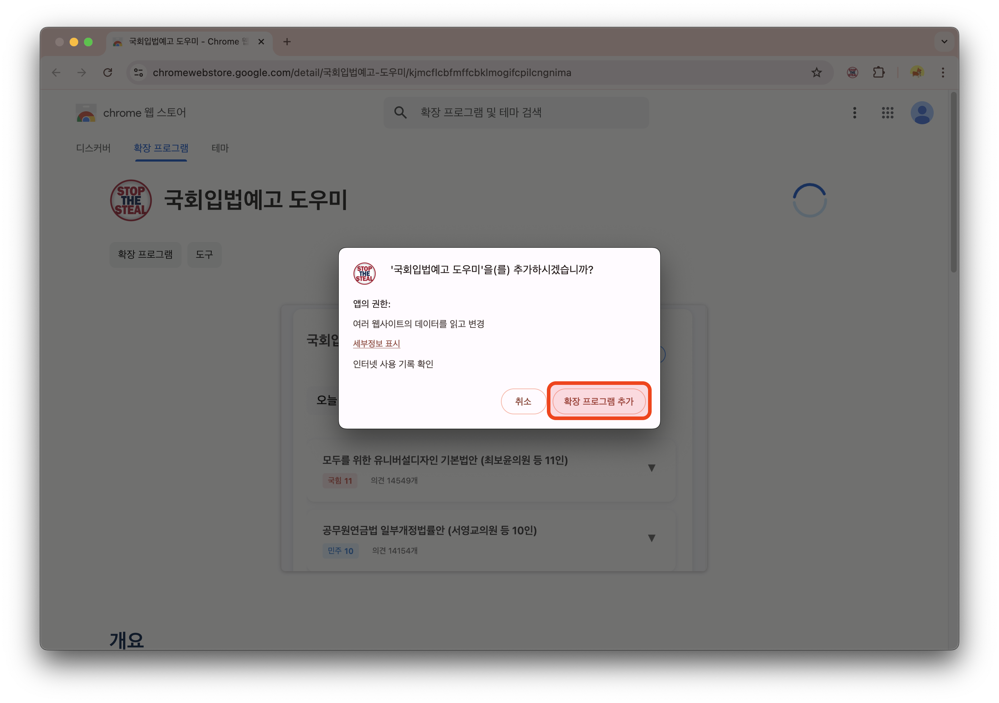

4. 오른쪽 상단 확장프로그램 아이콘 클릭 -> 고정핀 클릭.
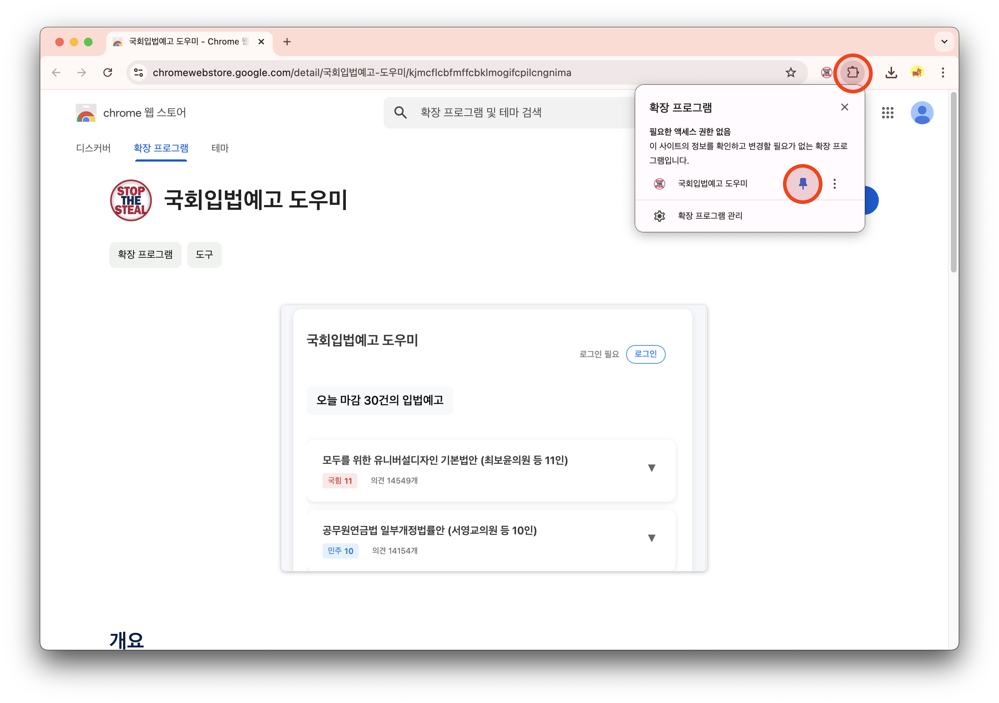

## 사용 방법

1. 크롬 브라우저 우상단 국회입법도우미 아이콘 클릭

2. 국회 웹사이트 로그인 (최초 1회). 로그인 완료 후 기다리면 자동으로 탭이 닫힙니다.
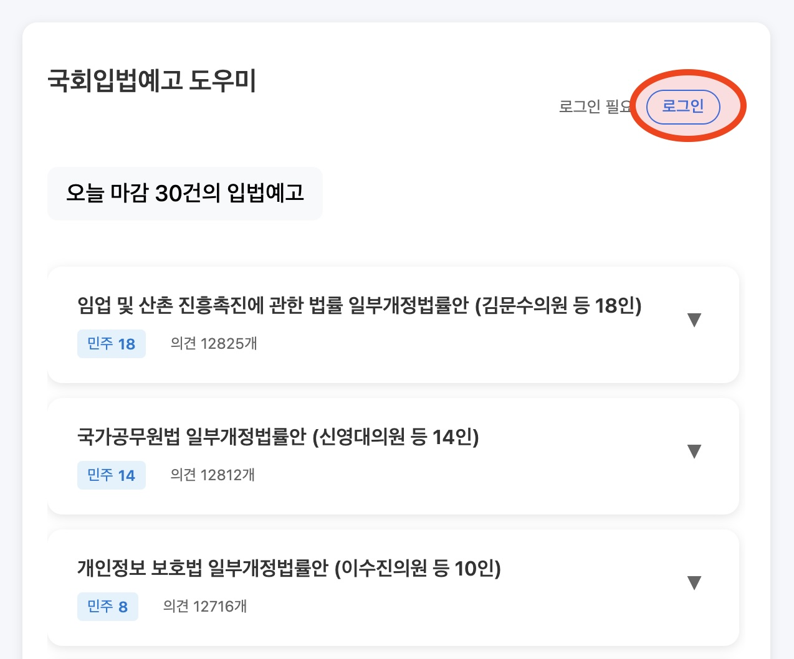

3. 법안 목록 클릭시 상세 내용확인 가능. 하단 의견등록 버튼 클릭.
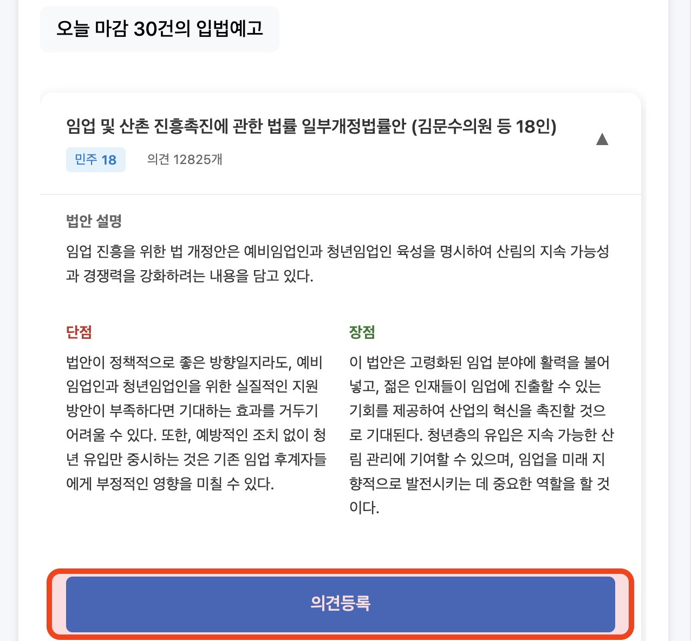

4. 의견 등록을 마친 법안은 맨 아래로 이동됩니다.
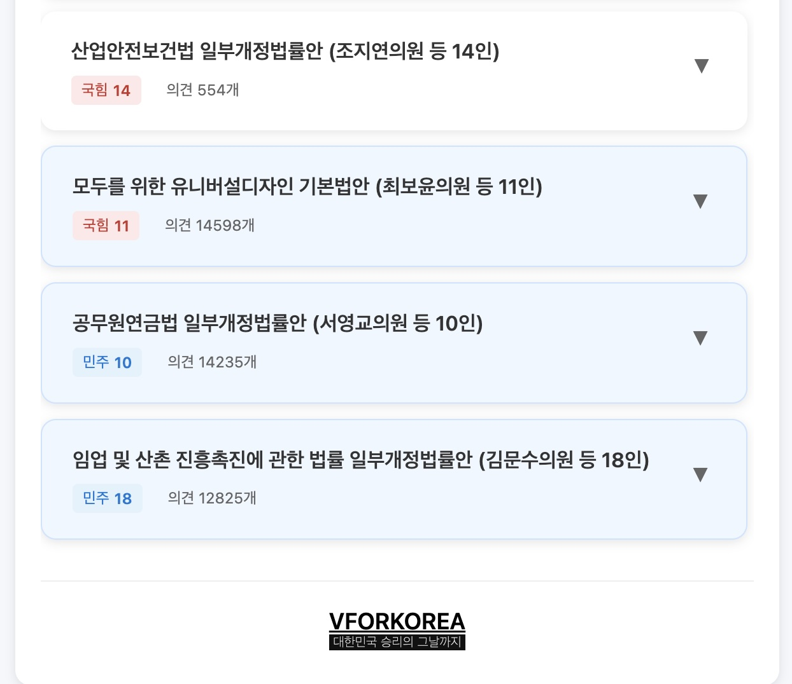

## 사용 방법 2 : 자동 등록기능 업데이트
   
1. 우상단 설정 아이콘 클릭
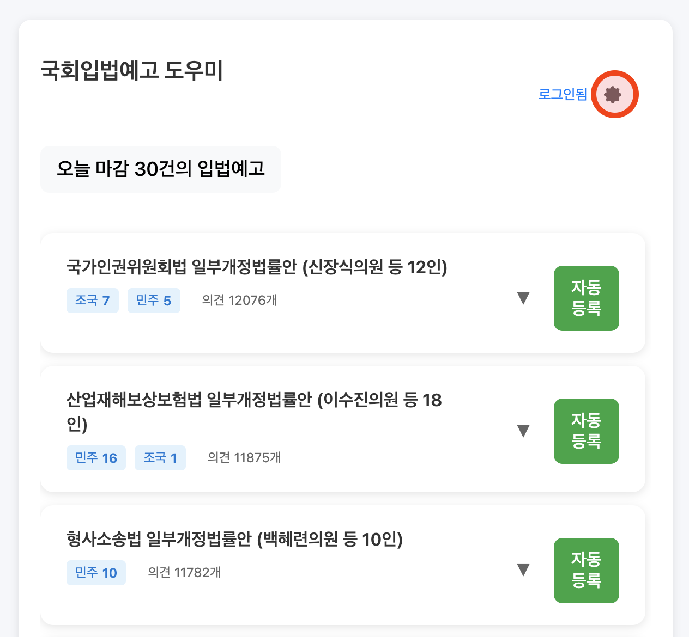

2. 사용할 제목과 내용 입력후 저장 클릭
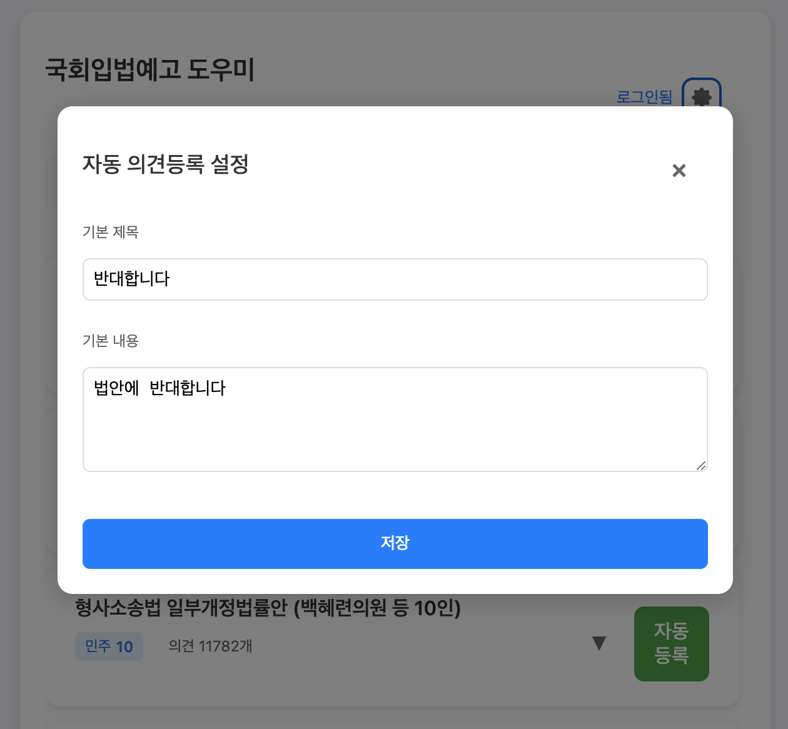

3. 자동등록 버튼 클릭시 미리 설정한 내용이 채워지고 보안문자 입력으로 커서가 이동 됨.
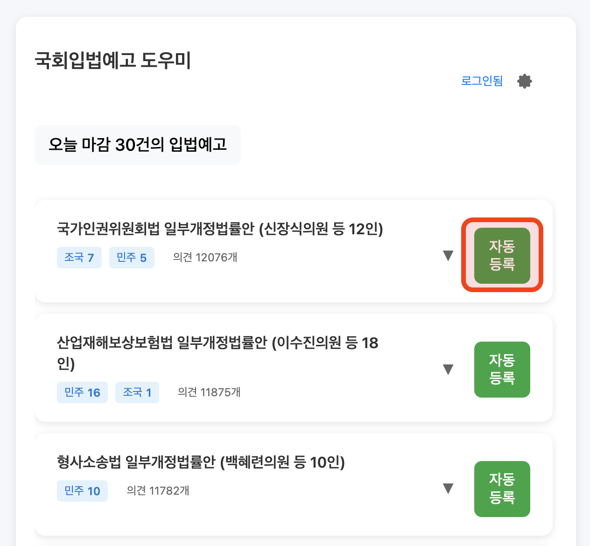

4. 보안문자 입력 후 등록 버튼 클릭(혹은 탭 후 엔터).
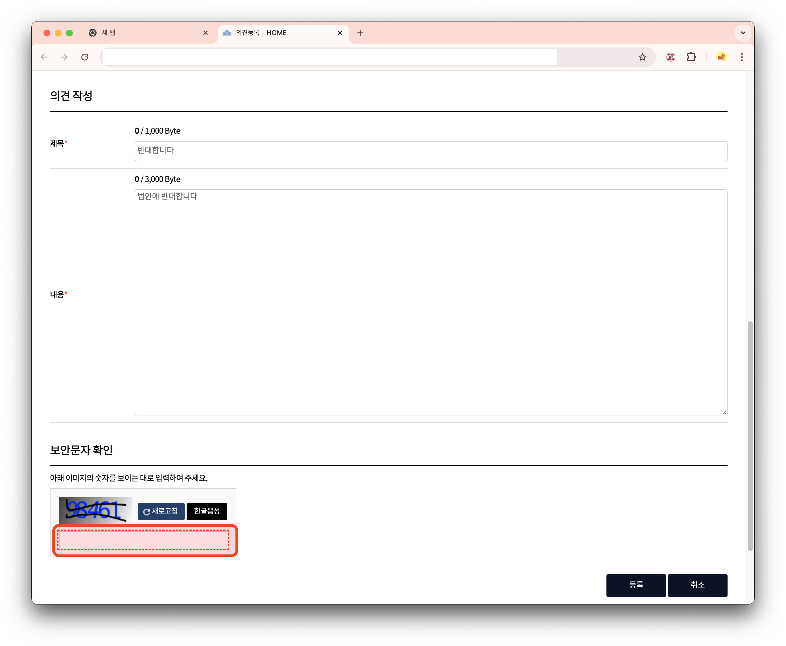

5. 모든 법안 의견 등록시 축하화면이 나옵니다🎉🎉

6. 단축키 버튼 업데이트(2025.2.1)
Alt + Q 버튼을 누르면 자동으로 입법예고 목록 첫 항목 자동등록을 시작합니다.
따라서 로그인 후 Alt + Q -> 보안문자 입력 -> 탭키 -> 엔터키 순서로 자동등록이 완료됩니다.

## 개발 정보

- 개발: Crusader-Korea
- 라이선스: MIT
- 버전: 1.0.2

## 라이선스

이 프로젝트는 MIT 라이선스 하에 오픈소스로 운영 배포되며, 모든 기여를 환영합니다. 버그 리포트, 새로운 기능 제안, 코드 기여 등 어떤 형태의 참여도 가능합니다.

## 한계점

이 프로젝트는 국회입법예고 사이트(https://pal.assembly.go.kr/napal/main/main.do) 와 VFORKOREA(https://vforkorea.com/assem/)의 페이지 구조를 기반으로 개발되었습니다. 해당 사이트의 구조나 정책 변경에 따라 프로그램이 정상적으로 동작하지 않을 수 있습니다.

## 연락처

문의사항이나 제안사항이 있으시다면 아래 채널을 통해 연락해주세요:

- 이메일: ko.crusader@gmail.com
- 웹사이트: https://github.com/Crusader-Korea/StopTheSteal-Korea

## 감사의 글

대한민국의 자유민주주의 발전을 위해 의견을 개진해주시는 모든 시민 여러분께 감사드립니다. 

특별히, 프로젝트 개발에 도움된 VFORKOREA(https://vforkorea.com/assem/) 에게 감사드립니다.